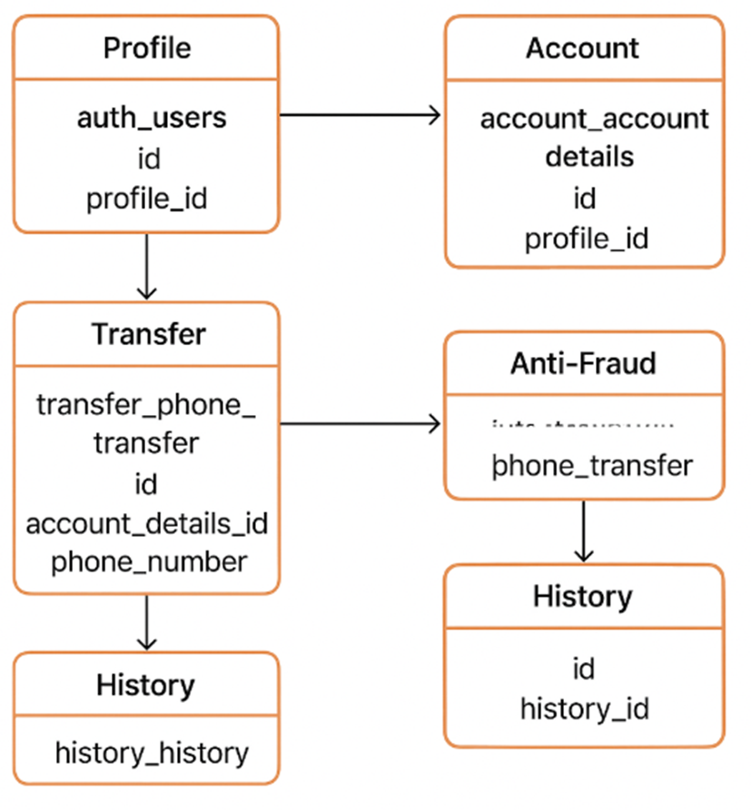

# 🏦 Документация по структуре БД банковского приложения

## 🧩 Общая концепция

Эта база данных описывает работу банковского приложения, построенного вокруг **профиля клиента**, к которому привязаны:
- паспортные данные,
- адрес регистрации,
- банковские счета,
- операции (переводы, пополнения, списания),
- аудит действий,
- антифрод-система (борьба с мошенничеством),
- публичная банковская информация (банки, филиалы, банкоматы).

Все модули связаны между собой через ключевые поля и внешние связи, обеспечивая целостность данных.

---

## 🔹 1. Модуль "Профиль клиента"

### Таблицы:
- `profile_profile`
- `profile_passport`
- `profile_actual_registration`
- `profile_audit`

### Назначение:
Хранит **основную информацию о клиенте**:
- имя на карте,
- паспортные данные,
- место регистрации (адрес),
- журнал изменений профиля.

### Логика работы:
1. При регистрации создается запись в `profile_profile`.
2. В `profile_passport` заносятся паспортные данные клиента.
3. В `profile_actual_registration` хранится адрес проживания.
4. Все изменения фиксируются в `profile_audit`.

---

## 🔹 2. Модуль "Счета"

### Таблицы:
- `account_account_details`
- `account_account`
- `account_audit`

### Назначение:
Описывает **банковские счета клиентов**, их реквизиты и историю изменений.

### Логика работы:
1. `account_account_details` содержит техническую информацию (номер счета, баланс, флаг отрицательного баланса, владелец).
2. `account_account` — метаданные счета (операции, дата создания, модификации).
3. `account_audit` фиксирует все изменения.

Каждый счет связан с `profile_profile` по полю `profile_id`.

---

## 🔹 3. Модуль "Транзакции / Переводы"

### Таблицы:
- `transfer_phone_transfer`
- `transfer_account_transfer`
- `transfer_card_transfer`
- `transfer_audit`

### Назначение:
Хранит **все виды переводов**, совершаемых пользователем:
- по номеру телефона,
- по номеру карты,
- по номеру счета.

### Логика работы:
1. При выполнении перевода создается запись в соответствующей таблице.
  - Например, для перевода по телефону — в `transfer_phone_transfer`.
2. Указывается получатель, сумма, назначение, ID счета отправителя (`account_details_id`).
3. Все операции фиксируются в `transfer_audit`.

---

## 🔹 4. Модуль "Антифрод" (Anti-Fraud)

### Таблицы:
- `anti_fraud_suspicious_card_transfer`
- `anti_fraud_suspicious_account_transfer`
- `anti_fraud_suspicious_phone_transfer`
- `anti_fraud_audit`

### Назначение:
Отвечает за **обнаружение подозрительных операций**.

### Логика работы:
1. Если система или оператор отмечает операцию как подозрительную, создается запись в одной из таблиц.
2. Хранятся:
  - ID перевода,
  - флаг блокировки,
  - причина,
  - описание подозрения.
3. Все изменения фиксируются в `anti_fraud_audit`.

---

## 🔹 5. Модуль "Публичная банковская информация"

### Таблицы:
- `public_bank_information_bank_details`
- `public_bank_information_license`
- `public_bank_information_certificate`
- `public_bank_information_branch`
- `public_bank_information_atm`
- `public_bank_information_audit`

### Назначение:
Хранит **информацию о банке и его филиалах**.

### Логика работы:
1. `public_bank_information_bank_details` — основные реквизиты банка.
2. К ней привязаны:
  - лицензии (`public_bank_information_license`),
  - сертификаты (`public_bank_information_certificate`).
3. `public_bank_information_branch` — филиалы, их адреса и контакты.
4. `public_bank_information_atm` — банкоматы и режим их работы.
5. Изменения фиксируются в `public_bank_information_audit`.

---

## 🔹 6. Модуль "Аутентификация / Пользователи"

### Таблица:
- `auth_users`

### Назначение:
Хранит учетные записи пользователей.

### Логика работы:
- Поля: `username`, `password_hash`, `role_id`.
- Роли определяют тип пользователя (клиент, оператор, администратор).
- Может быть связан с `profile_profile`.

---

## 🔹 7. Модуль "История"

### Таблица:
- `history_history`

### Назначение:
Собирает историю изменений по всем модулям.

### Логика работы:
- Содержит ссылки на различные audit-таблицы.
- Позволяет просмотреть полную историю по пользователю или операции.

---

## 🔗 Взаимодействие модулей (основная логика)

### Общая цепочка:

1. 👤 Создается **профиль клиента** → `auth_users` + `profile_profile`.
2. 🪪 Добавляются паспорт и адрес → `profile_passport` и `profile_actual_registration`.
3. 🏦 Открывается счет → `account_account_details` (привязка к профилю).
4. 💸 Совершается перевод → запись в `transfer_*`.
5. 🧠 Антифрод анализирует операцию → возможная запись в `anti_fraud_suspicious_*`.
6. 🧾 Все изменения пишутся в audit-таблицы и `history_history`.
7. 🏢 Параллельно обновляется информация о банках (`public_bank_information_*`).

---

## ⚙️ Пример потока данных

> **Сценарий:** пользователь совершает перевод по номеру телефона.

1. Из `auth_users` определяется профиль (`profile_id`).
2. По `profile_id` находится `account_details_id`.
3. Создается запись в `transfer_phone_transfer`.
4. В `transfer_audit` фиксируется факт перевода.
5. Если операция подозрительная — запись в `anti_fraud_suspicious_phone_transfer`.
6. Итог добавляется в `history_history`.

---

## 🧭 Диаграмма потока данных



---

## ⚙️ PostgreSQL SQL-примеры

### ▶ Регистрация клиента

```sql
BEGIN;

WITH new_user AS (
    INSERT INTO auth_users (username, password_hash, role_id)
    VALUES ('ivan.petrov', crypt('password123', gen_salt('bf')), 1)
    RETURNING id AS user_id
),
new_profile AS (
    INSERT INTO profile.profile (name_on_card, phone_number)
    VALUES ('IVAN PETROV', '+79998887766')
    RETURNING id AS profile_id
)
UPDATE auth_users 
SET profile_id = (SELECT profile_id FROM new_profile)
WHERE id = (SELECT user_id FROM new_user);

INSERT INTO profile.passport (series, number, issue_date, issued_by, profile_id)
VALUES ('4004', '123456', '2020-03-12', 'ГУ МВД РФ', (SELECT profile_id FROM new_profile));

INSERT INTO profile_actual_registration (country, region, city, street, house_number, profile_id)
VALUES ('Россия', 'Москва', 'Москва', 'Ленинградский проспект', '12', (SELECT profile_id FROM new_profile));

COMMIT;
```

---

### ▶ Создание счета

```sql
BEGIN;

WITH new_account AS (
    INSERT INTO account_account_details (account_number, profile_id, balance)
    VALUES ('40817810099910000001', 1, 0.00)
    RETURNING id AS account_details_id
)
INSERT INTO account_account (entity_type, operation_type, created_by, created_at, profile_id)
VALUES ('ACCOUNT', 'CREATE', 'system', NOW(), 1);

COMMIT;
```

---

### ▶ Перевод по номеру телефона

```sql
BEGIN;

WITH transfer_data AS (
    INSERT INTO transfer_phone_transfer (phone_number, amount, purpose, account_details_id)
    VALUES ('+79261234567', 2500.00, 'Перевод другу', 1)
    RETURNING id
)
INSERT INTO transfer_audit (entity_type, operation_type, created_by, timestamp, entity_json)
VALUES (
    'TRANSFER', 
    'PHONE', 
    'ivan.petrov', 
    NOW(), 
    json_build_object('amount', 2500, 'to', '+79261234567')
);

COMMIT;
```

---

### ▶ Проверка антифрода

```sql
INSERT INTO anti_fraud_suspicious_phone_transfer (phone_transfer_id, is_blocked, suspicious_reason)
SELECT id, TRUE, 'Сумма превышает допустимый лимит'
FROM transfer_phone_transfer
WHERE amount > 10000;
```

---

### ▶ Добавление записи в историю

```sql
INSERT INTO history_history (profile_audit_id, account_audit_id, transfer_audit_id)
VALUES (
    NULL,
    NULL,
    (SELECT id FROM transfer_audit ORDER BY id DESC LIMIT 1)
);
```

---

### ▶ Пример процедуры регистрации клиента

```sql
CREATE OR REPLACE FUNCTION register_new_client(
    p_username TEXT,
    p_password TEXT,
    p_name_on_card TEXT,
    p_phone TEXT
)
RETURNS VOID AS $$
DECLARE
    v_user_id INT;
    v_profile_id INT;
BEGIN
    INSERT INTO auth_users (username, password_hash, role_id)
    VALUES (p_username, crypt(p_password, gen_salt('bf')), 1)
    RETURNING id INTO v_user_id;

    INSERT INTO profile_profile (name_on_card, phone_number)
    VALUES (p_name_on_card, p_phone)
    RETURNING id INTO v_profile_id;

    UPDATE auth_users SET profile_id = v_profile_id WHERE id = v_user_id;

    INSERT INTO account_account_details (account_number, profile_id, balance)
    VALUES (LPAD(TRUNC(random() * 999999999)::TEXT, 20, '0'), v_profile_id, 0.00);

    RAISE NOTICE 'Клиент % успешно зарегистрирован!', p_username;
END;
$$ LANGUAGE plpgsql;
```

---

### ▶ Вызов процедуры

```sql
CALL register_new_client('ivan.petrov', 'MyStrongPass123', 'IVAN PETROV', '+79998887766');
```


---

## 📘 Резюме

| Модуль | Основная функция | Ключевые таблицы |
|--------|------------------|------------------|
| **Профиль** | Хранение данных клиента | `profile_*` |
| **Счета** | Реквизиты и баланс | `account_*` |
| **Переводы** | Финансовые операции | `transfer_*` |
| **Антифрод** | Проверка подозрительных операций | `anti_fraud_*` |
| **История** | Журнал изменений | `history_history` |
| **Публичная информация** | Данные о банках и филиалах | `public_bank_information_*` |
| **Пользователи** | Доступ и роли в системе | `auth_users` |

---


<h2>Описание проекта "Мета-Банк" от Кывыржик А.Г. от 13.04.2023</h2>

- [Summary](#summary)
- [Stack](#stack)
- [MVP](#mvp)
- [Бэкенд](#бэкенд)
- [Работа на проекте](#работа-на-проекте)
    - [С чего начинать](#с-чего-начинать)
    - [О таскборде](#о-таскборде)
    - [Как выполнять задачи](#как-выполнять-задачи)
    - [Проверка задач](#проверка-задач)
    - [Требования к коду](#требования-к-коду)
    - [Аутентификация](#аутентификация)

### Summary

Реализуем функционал банковского приложения, с базовой структурой БД (при добавлении новых технологий описание будет форматироваться).

### Stack

`Java 17`
`Spring Boot 2` - для более быстрой разработки бэка.
`Maven` - как инструмент сборки.
`PostgreSQL` - как БД.
`Spring Data` - для облегчения работы с БД.
`Hibernate` - как ORM.
`Lombok` - чтобы не писать boilerplate-код, используем на проекте [Lombok](https://projectlombok.org/features/all).
`Mapstruct` - для маппинга, [Mapstruct](https://www.baeldung.com/mapstruct).
`Liquibase` - для миграции БД, [Ссылка 1](https://habr.com/ru/post/460377/). [Ссылка 2](https://habr.com/ru/post/460907/).
`Openfeign` - для использования эврика-сервера, и фейн-клиентов для общения между микросервисами.
`Springdoc-openapi-ui` - [Swagger](https://docs.swagger.io/swagger-core/v1.5.0/apidocs/allclasses-noframe.html).
`Junit5` - для тестов.
`Mockito` - для тестов.
`Spring Test` - для интеграционных тестов.
`Spring-security` - для аутентификации и авторизации.
`Docker` - для поднятия контейнеров.
`Postman` - тестирования через запросы.
`Visual paradigm` - для проработки базовый структуры БД и генерации ченджлогов.

### MVP

[MVP](https://ru.wikipedia.org/wiki/%D0%9C%D0%B8%D0%BD%D0%B8%D0%BC%D0%B0%D0%BB%D1%8C%D0%BD%D0%BE_%D0%B6%D0%B8%D0%B7%D0%BD%D0%B5%D1%81%D0%BF%D0%BE%D1%81%D0%BE%D0%B1%D0%BD%D1%8B%D0%B9_%D0%BF%D1%80%D0%BE%D0%B4%D1%83%D0%BA%D1%82) - API (полностью описанное в Swagger).
Работать с таким API можно будет через веб-интерфейс Swagger и Postman.

### Бэкенд

Проект основан на микросерверной архитектуре.
А каждый микросервис выстроен по архитектуре REST.
Главный принцип следить, чтобы по логике одинаковые классы лежали в одном пакете.

Слои:
<ul>
<li><code>config</code> конфигурационные классы</li>
<li><code>entity</code> сущности базы данных</li>
<li><code>dto</code> специальные сущности для передачи/получения данных в/с апи</li>
<li><code>repository</code> dao-слой приложения, реализуем в виде интерфейсов Spring Data, имплементирующих JpaRepository.</li>
<li><code>service</code> бизнес-логика приложения, реализуем в виде интерфейсов и имплементирующих их классов.</li>
<li><code>controller</code> обычные и rest-контроллеры приложения.</li>
<li><code>validator</code> валидаторов.</li>
<li><code>exception</code> эксепшнов.</li>
<li><code>handler</code> хэндлеров.</li>
</ul>

